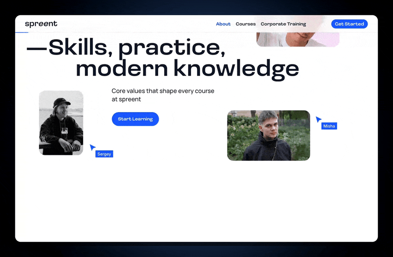
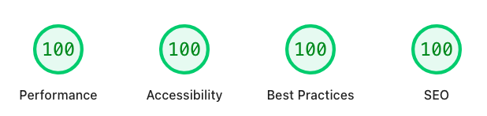

# Spreent Academy — Landing Page

[](https://github.com/OlgaGulyakevich/spreent-academy-frontend/actions/workflows/ci.yml)
[](https://astro.build/)
[](https://www.typescriptlang.org/)
[](https://sass-lang.com/)
[](https://vitest.dev/)
[](https://playwright.dev/)
[](https://pagespeed.web.dev/)

**A course-aggregator landing — hand-built to HTML Academy's pixel-perfect standard, then re-engineered on Astro for production.**

<a href="https://spreent-academy-frontend.vercel.app"><picture><source media="(prefers-reduced-motion: reduce)" srcset="docs/teaser-static.webp"/></picture></a>

## Live Demo

- **[Landing page](https://spreent-academy-frontend.vercel.app)** — the full experience
- **[UI Kit](https://spreent-academy-frontend.vercel.app/ui-kit)** — component library + **Motion catalog** (18 effects, principles, a11y notes)

---

## The Product Experience

**Spreent Academy** is a modern aggregator for educational courses. The single-page interface is designed as a conversion funnel that guides prospective students from first interest to application:

- **Discovery** — academy benefits, alumni community stats, the learning process.
- **Comparison** — transparent, side-by-side pricing tiers.
- **Conversion** — a frictionless, accessible application form with real-time international phone validation.

The aim: take a standard marketing flow and elevate it into a premium, interactive experience that builds trust and drives action.

---

## Motion & Interaction Craft

Motion here has a job — signal a premium, trustworthy product and carry the user through the funnel. It's physics-driven (real easing, lerp), never decorative; every effect is `prefers-reduced-motion`-guarded (WCAG 2.3.3) and GPU-only (`transform` / `opacity`, zero layout/paint per frame).

**First impression** — the first seconds say "this is polished":

- **Hero parallax** — photos drift on scroll + mouse for dual-axis depth
- **Magnetic button** — the hero CTA leans toward the cursor (lerp + rAF)
- **Logo paint-fill** — brand colour sweeps across the wordmark with a neon glow

**Guides & builds trust** — as the user scrolls:

- **Scroll reveal** — section headings fade & rise, and the certificate block cascades in (clip-path + scale, staggered) · **count-up** lands the credibility stats (78% / 89%) · **gradient-spin** + **ambient glow** add life

**Nudges conversion** — at the form:

- **Shimmer CTA** — a one-time glint draws the eye to Submit _only_ when the user settles on it and hesitates, and cancels the moment they engage (IntersectionObserver + 2s dwell + cancel-on-engage)

**Polish, everywhere** — burger ↔ ✕ morph · button press · smooth scroll · frosted sticky header

**See it live** → [landing](https://spreent-academy-frontend.vercel.app) · **documented** → [/ui-kit](https://spreent-academy-frontend.vercel.app/ui-kit)

---

## From Championship to Production

The original entry was hand-built (Vite, Handlebars, vanilla JS) to HTML Academy's strict pixel-perfect standard. This version is a **migration to Astro** that keeps that craft and adds production engineering:

| Before (championship)      | After (this repo)                            |
| -------------------------- | -------------------------------------------- |
| Vite + Handlebars partials | **Astro** SSG, component architecture        |
| Vanilla JS (ES modules)    | **TypeScript (strict)** — 13 typed modules   |
| Manual `<use>` SVG sprite  | **astro-icon** (auto-sprite, `currentColor`) |
| BackstopJS pixel tests     | **Vitest + Playwright** + **CI**             |
| RU content                 | EN, international audience                   |

**Why Astro?** For a content-heavy landing page, shipping a full SPA framework (Next.js, React) is overkill. Astro's **Zero-JS by default** approach ships pure HTML/CSS, making a 100/100 Lighthouse baseline realistic to hit and hold. Interactivity (form validation, custom motion) is progressive enhancement via vanilla TypeScript modules — logic runs only where it's needed.

---

## Tech Stack

| Category          | Tools                                                                  |
| ----------------- | ---------------------------------------------------------------------- |
| **Framework**     | Astro 7 (static output)                                                |
| **Language**      | TypeScript (strict, `noUncheckedIndexedAccess`)                        |
| **Styles**        | SCSS · BEM · desktop-first fluid `clamp()` layout                      |
| **Interactivity** | No framework, no animation library — motion hand-written in TypeScript |
| **Icons**         | astro-icon (inlined SVG sprite)                                        |
| **Forms**         | intl-tel-input (international phone + libphonenumber)                  |
| **Testing**       | Vitest · Playwright                                                    |
| **CI/CD**         | GitHub Actions · Vercel                                                |

---

## Quality & Engineering

- **PageSpeed Insights 100 / 100 / 100 / 100** — Performance · Accessibility · Best Practices · SEO, on **desktop and mobile**
- **TypeScript strict** across all 13 modules — `astro check` green
- **Testing (trophy, not coverage-chasing):** Vitest for logic (form validation), Playwright for critical-path e2e + visual regression (480 / 1440)
- **CI on every push / PR** — lint · types · unit tests · build · e2e
- **Pre-commit hooks** (husky + lint-staged) — format & lint staged files before they land
- **Strict CSP** (zero `unsafe-inline`) + security headers (COOP, HSTS); libphonenumber self-hosted to satisfy `script-src 'self'`



---

## Accessibility & Interface Craft

Built to EU-grade accessibility, with attention to real edge cases — not just the happy path:

- Semantic landmarks, `aria-live` notifications, `focus-visible` outlines
- Mobile menu: focus trap, `Escape` to close, focus returned to trigger, scroll lock
- `prefers-reduced-motion` respected on every animation
- **International phone field** (default Switzerland, per-country validation via libphonenumber) solving two real problems: **iOS autofill** (light frosted inputs keep entered text legible) and **WCAG AA contrast** on the dark footer
- **Zero-image decorative art** — the "Hands-On Skills" card's scene (frosted-glass panel, circle, and a Figma-style selection frame with corner handles) is drawn entirely in CSS — layered `background-image` gradients, `backdrop-filter`, pseudo-elements — with no raster assets; only the two cursors are inline SVG icons ([exhibited in the UI Kit](https://spreent-academy-frontend.vercel.app/ui-kit#cards))

---

## Project Structure

```text
src/
├── components/   # 7 section components (.astro)
├── data/         # typed arrays (.ts): nav-links, footer-links, pricing, work-logos
├── icons/        # SVGs for astro-icon (<Icon name="…" />)
├── layouts/      # BaseLayout (head, fonts, global styles, main.ts)
├── pages/        # index.astro · ui-kit.astro
├── scripts/      # 13 TypeScript modules + utils
└── sass/         # SCSS/BEM: variables, mixins, typography
public/           # img/ · fonts/ · favicons
```

---

## Getting Started

```bash
npm install
npm run dev      # dev server → localhost:3000
npm run build    # production build → dist/
```

Requires Node **22.x**.

## Commands

| Command            | What it does                                          |
| ------------------ | ----------------------------------------------------- |
| `npm run dev`      | Astro dev server → `localhost:3000`                   |
| `npm run build`    | Production build → `dist/`                            |
| `npm run preview`  | Serve the production build                            |
| `npm test`         | Unit / integration tests (Vitest)                     |
| `npm run test:e2e` | E2E + visual regression (Playwright)                  |
| `npm run check`    | TypeScript type-check (`astro check`)                 |
| `npm run lint`     | Prettier · astro check · Stylelint · ESLint · ls-lint |

*Note: Before running e2e tests for the first time, you must install Playwright browsers via `npx playwright install`.*

---

## Acknowledgements

- **Design:** [Mish](https://mish.design/en)
- **Organizer:** [HTML Academy](https://htmlacademy.ru/)

## Disclaimers

- **Demo form** — submissions are not stored (test endpoint).
- Single-page demo — secondary navigation links are illustrative.
- All company names and logos are trademarks of their respective owners, used for illustrative purposes only in this non-commercial student project.

## Author

<a href="https://github.com/OlgaGulyakevich">
  
</a>

**Olga Gulyakevich** — Frontend Developer<br>
[GitHub](https://github.com/OlgaGulyakevich) · [LinkedIn](https://www.linkedin.com/in/olga-gulyakevich-ab166674/)

<br clear="left"/>
