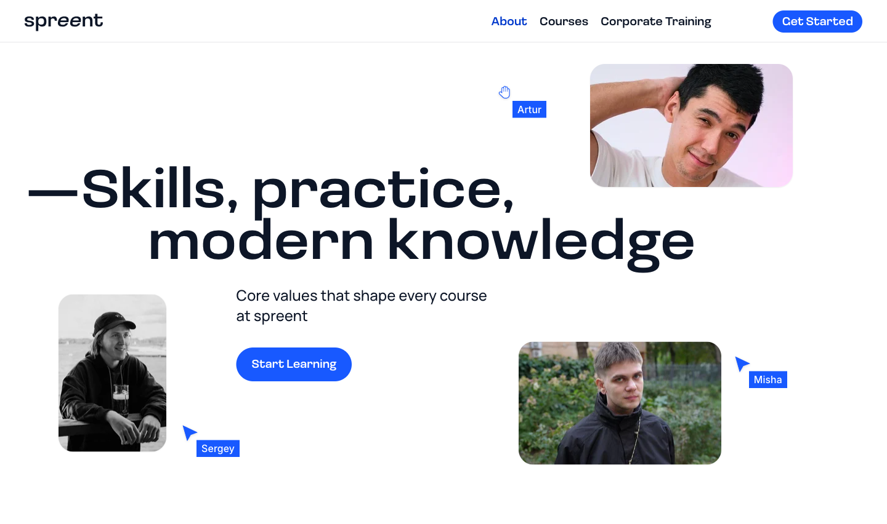

# Spreent Academy — Landing Page

[](https://github.com/OlgaGulyakevich/spreent-academy-frontend/actions/workflows/ci.yml)
[](https://astro.build/)
[](https://www.typescriptlang.org/)
[](https://sass-lang.com/)
[](https://vitest.dev/)
[](https://playwright.dev/)
[](https://pagespeed.web.dev/)

> Educational course aggregator — a single-page landing built for the **HTML Academy Frontend Championship #3** (April 2026), then **migrated to Astro** as a production-grade portfolio piece: component architecture, strict TypeScript, tests, and CI.

[](https://spreent-academy-frontend.vercel.app)

## 🔗 Live Demo

- **[Landing page](https://spreent-academy-frontend.vercel.app)** — the full experience
- **[UI Kit](https://spreent-academy-frontend.vercel.app/ui-kit)** — component library + **Motion catalog** (17 effects, principles, a11y notes)

---

## ✨ Motion & Interaction Craft

Motion is the signature of this build — physics-driven, not decorative. Every animation is deliberate: strong easing curves, an intentional _slow-in → snap-response_ asymmetry, and micro-interactions that reward attention.

- **Parallax** — hero photos _and_ about cards drift on scroll + mouse (additive layers, lerp-eased for depth)
- **Shimmer CTA** — a one-time glint nudges the Submit button _only_ once the user settles on it and hesitates; it cancels the moment they scroll away or start typing (IntersectionObserver + 2s dwell + cancel-on-engage)
- **Magnetic button** — the hero CTA drifts toward the cursor (lerp + rAF, spring-like)
- **Logo paint-fill** — brand colour paints across the wordmark with a neon glow (two-layer masked reveal on `transform`, no repaint)
- **Gradient-spin border** — a conic-gradient ring rotates via CSS `@property`
- **Mobile menu** — burger morphs to ✕ timed with the drawer, which fades-then-snaps shut
- _Supporting cast:_ scroll-reveal · count-up · ambient glow · logo rotation · sticky/frosted header · nav underline · button press · smooth scroll

**Engineered for accessibility & performance:**

- ♿ `prefers-reduced-motion` guard on **every** animation (WCAG 2.3.3) — JS skips the effect, CSS falls back to a static state
- ⚡ GPU-only: `transform` / `opacity` exclusively — zero layout/paint per frame

▶ **See it live** → [landing](https://spreent-academy-frontend.vercel.app) · 📋 **Documented** → [/ui-kit](https://spreent-academy-frontend.vercel.app/ui-kit)

<!-- 🎬 Demo video: record 5–10s (scroll → parallax → reveal → magnetic hover),
     compress with `optikit video compress --max`, then drag the .mp4 here in the GitHub editor. -->

---

## 🏗️ From Championship to Production

The original entry was hand-built (Vite, Handlebars, vanilla JS) to HTML Academy's strict pixel-perfect standard. This version is a **migration to Astro** that keeps that craft and adds production engineering:

| Before (championship)      | After (this repo)                            |
| -------------------------- | -------------------------------------------- |
| Vite + Handlebars partials | **Astro** SSG, component architecture        |
| Vanilla JS (ES modules)    | **TypeScript (strict)** — 13 typed modules   |
| Manual `<use>` SVG sprite  | **astro-icon** (auto-sprite, `currentColor`) |
| BackstopJS pixel tests     | **Vitest + Playwright** + **CI**             |
| RU content                 | EN, international audience                   |

Same pixel-perfect BEM/SCSS foundation — rebuilt on a component + type-safe architecture.

---

## 🛠️ Tech Stack

| Category          | Tools                                                                 |
| ----------------- | --------------------------------------------------------------------- |
| **Framework**     | Astro 7 (static output)                                               |
| **Language**      | TypeScript (strict, `noUncheckedIndexedAccess`)                       |
| **Styles**        | SCSS · BEM · desktop-first fluid `clamp()` layout                     |
| **Interactivity** | No framework, no animation library — motion hand-rolled in TypeScript |
| **Icons**         | astro-icon (inlined SVG sprite)                                       |
| **Forms**         | intl-tel-input (international phone + libphonenumber)                 |
| **Testing**       | Vitest · Playwright                                                   |
| **CI/CD**         | GitHub Actions · Vercel                                               |

---

## ✅ Quality & Engineering

- **PageSpeed Insights 100 / 100 / 100 / 100** — Performance · Accessibility · Best Practices · SEO, on **desktop and mobile**
- **TypeScript strict** across all 13 modules — `astro check` green
- **Testing (trophy, not coverage-chasing):** Vitest for logic (form validation), Playwright for critical-path e2e + visual regression (480 / 1440)
- **CI on every push / PR** — lint · types · unit tests · build · e2e
- **Pre-commit hooks** (husky + lint-staged) — format & lint staged files before they land
- **Strict CSP** (zero `unsafe-inline`) + security headers (COOP, HSTS); libphonenumber self-hosted to satisfy `script-src 'self'`


---

## ♿ Accessibility & Interface Craft

Built to EU-grade accessibility, with attention to real edge cases — not just the happy path:

- Semantic landmarks, `aria-live` notifications, `focus-visible` outlines
- Mobile menu: focus trap, `Escape` to close, focus returned to trigger, scroll lock
- `prefers-reduced-motion` respected on every animation
- **International phone field** (default 🇨🇭 Switzerland, per-country validation via libphonenumber) with two real problems solved: **iOS autofill** (light frosted inputs keep entered text legible) and **WCAG AA contrast** on the dark footer

---

## 📁 Project Structure

```text
src/
├── components/   # 7 section components (.astro)
├── data/         # typed arrays (.ts): nav-links, footer-links, pricing, work-logos
├── icons/        # SVGs for astro-icon (<Icon name="…" />)
├── layouts/      # BaseLayout (head, fonts, global styles, main.ts)
├── pages/        # index.astro · ui-kit.astro
├── scripts/      # 13 TypeScript modules + utils
└── sass/         # SCSS/BEM: variables, mixins, typography
public/           # img/ · fonts/ · favicons
```

---

## 🚀 Getting Started

```bash
npm install
npm run dev      # dev server → localhost:3000
npm run build    # production build → dist/
```

Requires Node **22.x**.

## Commands

| Command            | What it does                                          |
| ------------------ | ----------------------------------------------------- |
| `npm run dev`      | Astro dev server → `localhost:3000`                   |
| `npm run build`    | Production build → `dist/`                            |
| `npm run preview`  | Serve the production build                            |
| `npm test`         | Unit / integration tests (Vitest)                     |
| `npm run test:e2e` | E2E + visual regression (Playwright)                  |
| `npm run check`    | TypeScript type-check (`astro check`)                 |
| `npm run lint`     | Prettier · astro check · Stylelint · ESLint · ls-lint |

---

## 🙌 Acknowledgements

- **Design:** [Mish](https://mish.design/en)
- **Organizer:** [HTML Academy](https://htmlacademy.ru/)

## ⚖️ Disclaimers

- **Demo form** — submissions are not stored (test endpoint).
- Single-page demo — secondary navigation links are illustrative.
- All company names and logos are trademarks of their respective owners, used for illustrative purposes only in this non-commercial student project.

## 👤 Author

**Olga Gulyakevich** — Frontend Developer
